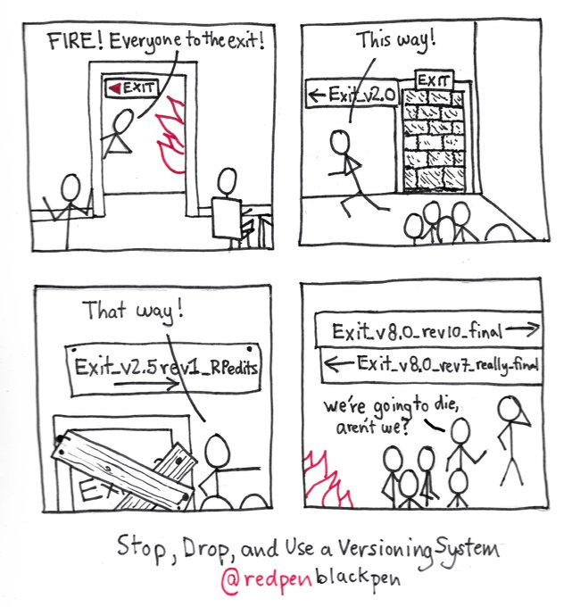

layout: true
class: animated, fadeIn

---
class: inverse, left, middle

# _Control de versiones: Git y GitHub._


Martín Venegas Márquez $^1$


***
[Modelos Multinivel - SOC01133/MCS7174 • Primer Semestre 2025]()

<br>

#### Marzo, 2025
##### $^1$ Universidad de Chile

---
# Contenidos de la sesión 

.left-column[

**¿Qué es el control de versiones?**

1. Definiciones y analogías

**¿Por qué utilizar el control de versiones?**

1. Crisis en la ciencia

2. Reproducibilidad

]


.right-column[
**Sección práctica**

1. Herramientas: Introducción a R Markdown

2. Ejercicio control de versiones

**Control de versiones y reproducibilidad**

1. Conceptos centrales

2. Trabajo colaborativo

3. Repositorios: remote y local   

4. Clone, Branch, Commit, Push... pull request (?)
]

---
class: middle, center, inverse

# _¿Qué es el control de versiones?_

---
# Definiendo el control de versiones

.left-column[
> Un control de versiones es un **sistema** que **registra los cambios** realizados en un archivo o conjunto de archivos a lo largo del **tiempo**, de modo que puedas **recuperar** versiones específicas más adelante ([Git](https://git-scm.com/book/es/v2/Inicio---Sobre-el-Control-de-Versiones-Acerca-del-Control-de-Versiones))
]

.right-column[
> Los sistemas de control de versiones son un tipo de **software** que ayuda a hacer un **seguimiento de los cambios** realizados en el código a lo largo del **tiempo**. A medida que un desarrollador edita el código, el sistema de control de versiones toma una instantánea de los archivos. Después, guarda esa instantánea de forma permanente para que se pueda **recuperar** más adelante si es necesario ([Microsoft](https://learn.microsoft.com/es-es/devops/develop/git/what-is-version-control))

]


---

# Definiendo el control de versiones

- **Idea principal:** Un sistema que permite llevar un registro de los cambios efectuados a uno o más archivos a través del tiempo

- Google Docs y Microsoft Word como las formas más conocidas de llevar un registro de cambios: **control de cambios e historial de versiones**

- Usar el nombre de los archivos para denotar la versión


---

---


---

.center[

]
---
.center[

]
---
class: middle, center, inverse

# _¿Por qué usar el control de versiones_

---
class: middle, center, inverse

# _Primera razón: credibilidad_

---
# Crisis en la ciencia
.left-column[
* Ha sido entendida como un problema de **transparencia** en:
    * Diseños de investigación 
    * Procedimientos de investigación 
    * Apertura y acceso a materiales de investigación
    
* Dentro de las motivos y consecuencias:

    * Problemas para replicar (o reproducir) resultados
    * Confianza en los resultados se pone en duda
]

.right-column[.center[


[Baker (2016)](https://www.nature.com/articles/533452a)  
]
]

---
# Prácticas de investigación 

* Fabrication, Falsification, Plagiarism (Invención, Falsificación y Plagio - FPP)
* Prácticas cuestionables de investigación (QRP)
* Conducta Responsable de Investigación (RCR)

.center[
 

Gradación del comportamiento integro en investigación. Imagen de [Steneck (2006)](https://link.springer.com/article/10.1007/PL00022268)]
---
# Caso de fraude: Diderik Stapel

.left-column[
* Prestigioso psicológo social
* 137 artículos publicados
* 54 artículos retractados
* **Motivo:** 
    * Falsificación y manipulación de datos
* **Consecuencias:** 
    * Desvinculado de la Tilburg University
    * Se le rebocó su título de doctorado
]

.right-column[

] 

---
# Principios [mertonianos](https://www.panarchy.org/merton/science.html) de la ciencia

- **Universalismo:** La idea de que las afirmaciones científicas deben estar sujetas criterios objetivos preestablecidos e impersonales.

- **Comunalismo:** Los hallazgos de la ciencia son propiedad común de la comunidad científica y el progreso científico depende de la comunicación abierta y el intercambio.

- **Desinterés:** La ciencia debería limitar la influencia del sesgo tanto como sea posible y debería hacerse por el bien de la ciencia, más que por interés propio o poder.

- **Escepticismo organizado:** La necesidad de prueba o verificación somete a la ciencia a más escrutinio que cualquier otro campo.
---
# ¿Qué podemos hacer?

.left-column[

* Para incrementar la transparencia debemos actuar sobre los distintos **momentos de una investigación**

1. Diseño 
2. Procedimientos
3. Pre-publicación
4. Publicación 
]

.right-column[
* Crüwell et al. (2018) propone avanzar a una cultura que promueva:

  * Pre-registros
  * **Acceso abierto:** la importancia de los datos, material y código abierto.
  * Análisis **reproducibles**
  * La **replicación** 
  * Enseñanza de la ciencia abierta]
---
# ¿Cómo avanzamos?

* Prácticas de investigación orientadas a la reproducibilidad:

  * Publicación de datos (Dataverse, OSF)
  * Código de análisis abierto (Github, OSF)
  * Uso de software libre y de código abierto (R, Python, Markdown)
  * Protocolos de trabajo reproducible (TIER project)
  * Control de versiones (Git)

.center[


]

---


---

---
class: middle, center, inverse

# _Segunda razón: eficiencia_

---
- Proyectos grandes y complejos: muchas decisiones entre muchas personas a través del tiempo

- Necesidad de organizar esta complejidad, minimizar errores y hacer flujos de trabajos más eficientes

- Del control de versiones a entornos colaborativos
---
## Bowers, J., & Voors, M. (2016)

.center[]
---
# Mejor relación con tu futuro yo

 (1) **El análisis de datos es programación**: Codear todo lo que se pueda codear, evitar trabajo manual (_copypaste_) y asi minimizar errores

(2) **Ningún análisis de datos es una isla por mucho tiempo:** No lo hacemos solo nosotros, eventualmente llega a otra persona. Comentar código y documentar.

(3) **El territorio del análisis de datos requiere mapas:** Debemos saber de dónde vienen los datos y qué opéraciones se hacen en qué set de datos. Organización de carpetas y nombres de archivos intuitiva.
---
class: inverse

# Mejor relación con tu futuro yo

(4) [**El control de versiones previene el _clobbering_, reconcilia el historial y ayuda a organizar el trabajo:** Evitar perdida de información y conflictos ]()

- Es necesario saber qué versiones de archivos son nuevas, cuáles son viejas y qué ha cambiado entremedio (track changes)

- **Clobbering:** cuando se elimina trabajo hecho por accidente o cuando se crean duplicados y es necesario revisar al detalle cuál es el original (gastando tiempo y energías)
---
class: middle, center, inverse

# _¿Cómo utilizar el control de versiones?_
---
# Control de versiones

* Un flujo de trabajo basado en **Git** facilita:
  
  1. Control sobre versiones de uno o más documentos.
  2. Observar "pasado y presente" de un proyecto completo.
  2. Apertura y transparencia (repositorios). 
  3. Trabajo Colaborativo
  4. **Estructura de proyectos**
  
---
# Colaboración

.left-column[

* Una de las ventajas de trabajar en un marco basado en Git es que podemos colaborar con diferentes personas dentro de un **mismo proyecto**. (p.ej. tutor-estudiante, equipo de trabajo, etc)

* Controlar qué es lo que _cambia_ y qué es lo que se _conserva_.

* **Aceptar** o **rechazar** cambios surgeridos por otr-s usuari-s 

]

.right-column[ ]

---
# Repositorios: remote y local


> **Repositorio**: Un directorio o espacio de almacenamiento donde pueden _vivir_ sus proyectos. A veces los usuarios de GitHub acortan esto a "repo". 

> Puede ser local a una carpeta de tu ordenador, o puede ser un espacio de almacenamiento en GitHub o en otro host online. Puedes guardar archivos de código, de texto, de imagen, lo que quieras, dentro de un repositorio.


.center[
]

---

**Clone**: Se utiliza para apuntar a un repositorio existente y crear un clon, o una copia del repositorio de destino. 

**Branch**: Una "branch" representa una línea independiente de trabajo. Las _branches_ sirven como una abstracción de los procesos de cambio, preparación y confirmación.

**Commit**: Una confirmación, o "revisión", es un cambio individual en un archivo (o conjunto de archivos). Con Git, cada vez que lo guardas se crea un ID único (también conocido como "SHA" o "hash") que te permite llevar un registro de qué cambios se hicieron cuándo y por quién.

**Push**: El comando "push" se usa para publicar nuevos commits locales en un servidor remoto.

**Fetch**: El comando "fetch" descarga commits, archivos y referencias de un repositorio remoto a tu repositorio local. "Fetch" es lo que haces cuando quieres ver en qué han estado trabajando los demás.


**Pull**: Se usa para recuperar y descargar contenido de un repositorio remoto e inmediatamente actualizar el repositorio local para que coincida con ese contenido. 

---

.center[]

---
**Pull request**: Son una característica específica de `GitHub.` Proporcionan una forma simple, basada en la web, de enviar tus cambios. En concreto, es pedirle al proyecto (main-branch) que extraiga los cambios de tu branch.

.center[]

---
# Práctica

## Parte I: individual

1. Crear un repositorio independiente que se llame "taller-git".
2. Clonar localmente usando RStudio
2. Modificar localmente desde *main*
  * Realizar commit local
  * Realizar push hacia el repositorio remoto (en GitHub)
3. Chequear cambios online  
  
---
# Práctica
## Parte II: colaborativo

1. Clonar el repositorio [jciturras/git-elsoc](https://github.com/jciturras/git-elsoc.git) localmente usando RStudio.
2. Seleccionar una branch  (metodos o antecedentes)
3. Crear un archivo .Rmd para cada una de las branches
  * `metodos.Rmd`
  * `antecedentes.Rmd`
4. Lograr 'guardar' cambios a través de un commit en su branch respectiva
5. Realizar push hacia el repositorio remoto (en GitHub)
6. Pull Request $\rightarrow$ main (remote)

---
# Algunos tips de configuración 

En RStudio:

> Tools $\rightarrow$ Terminal $\rightarrow$ New Terminal (`Alt+Shift+R`)

```{r echo=TRUE,eval=F}
git config --global user.email "usuario2021@gmail.com" 
git config --global user.name "nombreusuario"
```

---
class: middle, center

### `r  fontawesome::fa(name = "github", fill = "black")` <br> [github.com/jciturras](https://github.com/jciturras) 


